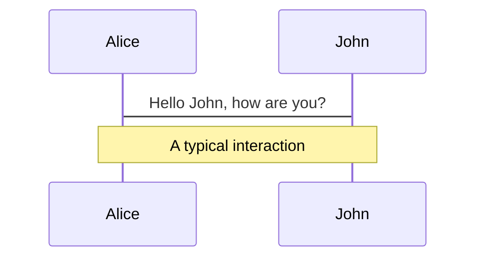
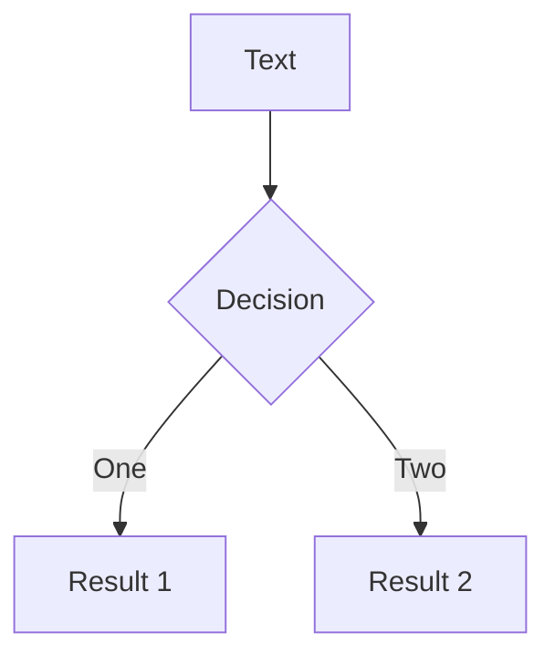
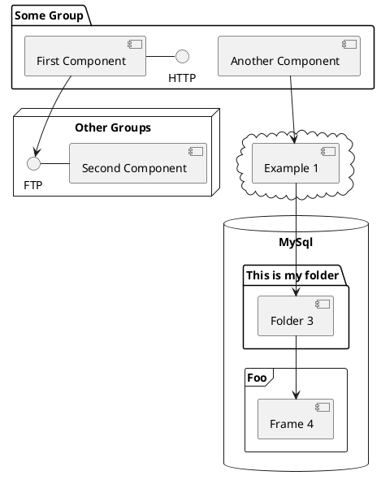

---
# try also 'default' to start simple
theme: default
# random image from a curated Unsplash collection by Anthony
# like them? see https://unsplash.com/collections/94734566/slidev
background: '#1f222a'
# apply any windi css classes to the current slide
class: 'text-center'
# https://sli.dev/custom/highlighters.html
highlighter: shiki
# show line numbers in code blocks
lineNumbers: false
# some information about the slides, markdown enabled
info: |
  ## Slidev Starter Template
  Presentation slides for developers.

  Learn more at [Sli.dev](https://sli.dev)
# persist drawings in exports and build
drawings:
  persist: false
# page transition
transition: slide-left

fonts:
  sans: 'Plus Jakarta Sans'
  mono: JetBrains Mono
---

# Demystifying WebRTC

A gentle introduction to the protocols powering Audio/Video calls worldwide.

<!-- <div class="pt-12">
  <span @click="$slidev.nav.next" class="px-2 py-1 rounded cursor-pointer" hover="bg-white bg-opacity-10">
    Press Space for next page <carbon:arrow-right class="inline"/>
  </span>
</div> -->

<div class="abs-br m-6 flex gap-2">
  <a href="https://github.com/SphericalKat/demystifying-webrtc" target="_blank" alt="GitHub"
    class="text-xl slidev-icon-btn opacity-50 !border-none !hover:text-white">
    <carbon-logo-github />
  </a>
</div>

<!--
The last comment block of each slide will be treated as slide notes. It will be visible and editable in Presenter Mode along with the slide. [Read more in the docs](https://sli.dev/guide/syntax.html#notes)
-->

---
transition: fade-out
layout: default
---

# What _is_ WebRTC? Why is it useful?

<br/>


- 📝 **Protocol** - Specifies how 2 agents can negotiate _bi-directional_ _secure_ _real-time_ communication.
- 🎨 **API** - Allows developers to use the WebRTC protocol.
- 🧑‍💻 **Open standard** - WebRTC is an open standard with multiple FOSS implementations.
- 🤹 **Widely available** - All modern browsers support WebRTC.
- 🎥 **Industry Standard** - The backbone of the Audio/Video call industry.
- 📤 **Mandatory encryption** - Communication between two peers is mandatorily encrypted.

<!--
You can have `style` tag in markdown to override the style for the current page.
Learn more: https://sli.dev/guide/syntax#embedded-styles
-->

<style>

</style>

<!--
WebRTC is both a protocol and an API. The protocol specifies how 2 agents on the internet
can negotiate bidirectional, secure, real time communication.

The API allows you to use the protocol.

A similar relationship would be the one between HTTP and the Fetch API.
WebRTC the protocol would be HTTP, and WebRTC the API would be the Fetch API.

This list is not exhaustive, just an example of some of the things you may appreciate during your journey.
Don’t worry if you don’t know all these terms yet, we will go through them along the way.
-->

---
transition: slide-up
---

# Four steps to success

We can broadly divide the WebRTC protocol into four sections.

<br />


1. **Signaling** - How peers find each other in WebRTC.
2. **Connecting** - NAT Traversal with STUN/TURN
3. **Securing** - The transport layer with DTLS and SRTP
4. **Communicating** - With peers via RTP and SCTP


<!--
WebRTC solves a lot of problems. At first glance the technology may seem over-engineered, but the genius of WebRTC is its humility. It wasn’t created under the assumption that it could solve everything better. Instead, it embraced many existing single purpose technologies and brought them together into a streamlined, widely applicable bundle.

These steps are sequential, which means the prior step must be 100% successful for the subsequent step to begin.

One peculiar fact about WebRTC is that each step is actually made up of many other protocols! To make WebRTC, we stitch together many existing technologies. In that sense, you can think of WebRTC as being more a combination and configuration of well-understood tech dating back to the early 2000s than as a brand-new process in its own right.
 -->

---
layout: default
---

# Signaling

- **WebRTC agents** have no idea who to communicate with. Signalling is used to bootstrap the call.
- **Signaling** - uses an existing plaintext protocol called **SDP** (Session Description Protocol)
- Each **SDP** message is made up of Key-Value pairs, which contains information such as:
  - The **IPs** and **Ports** that the agent is reachable on (candidates).
  - The number of audio and video **tracks** the agent wishes to send.
  - The audio and video **codecs** each agent supports.
  - Some values used while connecting (`uFrag`/`uPwd`).
  - The **certificate fingerprint** used while securing the connection.
- WebRTC uses the **offer/answer** model. One WebRTC agent makes an "**Offer**" to connect, and the other agent "**Answers**" if it is willing to accept what has been offered.
- This gives the answerer a chance to **reject unsupported codecs**. This is how two peers can understand what formats they are willing to exchange.

<style>
    li {
        padding-top: 8px;
        @apply text-sm;
    }
</style>
<!-- 

This might seem a bit conterintuitive, but it makes sense if you think about it.

When a WebRTC Agent starts, it has no idea who it is going to communicate with or what they are going to communicate about. The Signaling step solves this issue. Signaling is used to bootstrap the call, allowing two independent WebRTC agents to start communicating.

Signaling uses an existing, plain-text protocol called SDP (Session Description Protocol). Each SDP message is made up of key/value pairs and contains a list of “media sections”. The SDP that the two WebRTC agents exchange contains details like:

(refer to slide content)

It is important to note that signaling typically happens “out-of-band”, which means applications generally don’t use WebRTC itself to exchange signaling messages.

many applications will simply use their existing infrastructure (e.g. REST endpoints, WebSocket connections, or authentication proxies) to facilitate trading of SDPs between the proper clients.

-->

---
layout: default
---

# SDP spec
Consists of Key-Value pairs. Following are the keys used by WebRTC.

- `v` - Version, should be equal to `0`.
- `o` - Origin, contains a unique ID useful for renegotiations.
- `s` - Session Name, should be equal to `-`.
- `t` - Timing, should be equal to `0 0`.
- `m` - Media Description `(m=<media> <port> <proto> <fmt> ...)`, described in detail later.
- `a` - Attribute, a free text field. This is the most common used line in WebRTC.
- `c` - Connection Data, should be equal to `IN IP4 0.0.0.0`.

---
layout: default
---

# SDP breakdown

<div grid="~ cols-2 gap-4">

<div>

```text {all|5|6|7-10|all}
v=0
o=- 3546004397921447048 1596742744 IN IP4 0.0.0.0
s=-
t=0 0
a=fingerprint:sha-256 0F:74:31:25:CB:A2:13:EC:28:6F:6D:2C:61:FF:5D:C2:BC:B9:DB:3D:98:14:8D:1A:BB:EA:33:0C:A4:60:A8:8E
a=group:BUNDLE 0 1
a=candidate:foundation 1 udp 2130706431 192.168.1.1 53165 typ host generation 0
a=candidate:foundation 2 udp 2130706431 192.168.1.1 53165 typ host generation 0
a=candidate:foundation 1 udp 1694498815 1.2.3.4 57336 typ srflx raddr 0.0.0.0 rport 57336 generation 0
a=candidate:foundation 2 udp 1694498815 1.2.3.4 57336 typ srflx raddr 0.0.0.0 rport 57336 generation 0
a=end-of-candidates

// media description
```

<!-- -->

</div>
<div>
 <ul>
 <li><code>fingerprint:sha-256</code> - This is a hash of the certificate a peer is using for DTLS. After the DTLS handshake is completed, you compare this to the actual certificate to confirm you are communicating with whom you expect.</li>

  <li><code>group:BUNDLE</code> - Bundling is an act of running multiple types of traffic over one connection. Some WebRTC implementations use a dedicated connection per media stream. Bundling should be preferred.</li>
  
  <li><code>candidate</code> - This is an ICE Candidate that comes from the ICE Agent. This is one possible address that the WebRTC Agent is available on. These are fully explained in the upcoming slides.</li>
 </ul>
</div>

</div>

<style>
    li {
        padding-top: 8px;
        @apply text-sm;
    }
</style>

---
layout: two-cols
---

# Media description in SDP

```text {all|4|5|6|1,9|10|all}
m=audio 9 UDP/TLS/RTP/SAVPF 111
c=IN IP4 0.0.0.0
a=setup:active
a=mid:0
a=ice-ufrag:CsxzEWmoKpJyscFj
a=ice-pwd:mktpbhgREmjEwUFSIJyPINPUhgDqJlSd
a=rtcp-mux
a=rtcp-rsize
a=rtpmap:111 opus/48000/2
a=fmtp:111 minptime=10;useinbandfec=1
a=ssrc:350842737 cname:yvKPspsHcYcwGFTw
a=ssrc:350842737 msid:yvKPspsHcYcwGFTw DfQnKjQQuwceLFdV
a=ssrc:350842737 mslabel:yvKPspsHcYcwGFTw
a=ssrc:350842737 label:DfQnKjQQuwceLFdV
a=msid:yvKPspsHcYcwGFTw DfQnKjQQuwceLFdV
a=sendrecv
```

::right::


- `mid` - Used for identifying media streams within a session description.
- `ice-ufrag` - This is the user fragment value for the ICE Agent. Used for the authentication of ICE Traffic.
- `ice-pwd` - This is the password for the ICE Agent. Used for the authentication of ICE Traffic.
- `rtpmap` - This value is used to map a specific codec to an RTP Payload Type. Payload types are not static, so for every call the offerer decides the payload types for each codec.
- `fmtp` - Defines additional values for one Payload Type. This is useful to communicate a specific video profile or encoder setting.
- `ssrc` - A Synchronization Source (SSRC) defines a single media stream track. `label` is the ID for this individual stream. `mslabel` is the ID for a container that can have multiple streams inside it.

<style>
    ul {
        padding-top: 4rem;
        padding-left: 16px;
    }
    li {
        @apply text-sm;
    }
</style>

<!-- 

-->

---
layout: default
---

# Step 2: Connection

 - Very often, the other WebRTC agent will not be on the same network. Calls will have to go over the public internet.
 - Some networks don’t allow UDP traffic at all, or maybe they don’t allow TCP. Some networks may have a very low MTU (Maximum Transmission Unit). There are lots of variables that network administrators can change that can make communication difficult.
 - Almost every user on the internet is behind a **NAT** (Network Address Translator). This helps ISPs avoid IPv4 exhaustion, but causes problems for WebRTC connections.
 - NAT, or Network Address Translation, is a method used by routers to allow multiple devices on a private network to share a **single public IP address**. NAT works by **modifying the IP addresses** of network packets as they pass through the router, **replacing the private IP** addresses of the devices on the network with the **public IP address of the router**. This allows the devices to access the internet without each needing its own public IP address.

<style>
    ul {
    }
    li {
        font-size: 1rem;
        line-height: 1rem;
        @apply pt-4;
    }
</style>

<!-- 
The problems with NAT being that only the router itself has a public IP, and individual devices on it don't;
so how does webrtc figure out which device to connect to? The answer is NAT mappings. In a nutshell, this is simply
a table maintained by the router where it maps a list of IP addresses that have contacted/been contacted by the local router
to a local port. 

This is very useful for having multiple devices share a single public IP address, but makes sending data to a 
particular device difficult. To get around this, we use STUN/TURN server.

-->

---
layout: default
---

# STUN
Session Traversal Utilities for NAT

- Existed before WebRTC
- Allows for the programmatic creation of NAT Mappings, and also gives you the mapping details that you can share with the other peer, so they can send traffic to you via the mapping you just created.
- Peers send a `STUN Binding Request` to the STUN server. The server responds with a `STUN Binding Response`, which contains an IP (the sender's public IP) and a port (the port bound by the NAT mapping).
- This information is sent to the other peer via the SDP exchange during signaling.
- However, the mapped address is not always helpful. Some NATs do not let in traffic unless the router has initiated connection with them first. In this case, packets are not allowed in through the mapping. To get over this, we use TURN.

---
layout: default
---

# STUN


---
layout: default
---

# TURN
Traversal Using Relays around NAT
- Used when direct connectivity isn't possible. Could be due to incompatible NAT types, or maybe the NATs don't speak the same protocol.
- Uses a dedicated server, which acts as a proxy for a peer. The client connects to a TURN Server and creates an `Allocation`. By creating an allocation, a client gets a temporary IP/Port/Protocol that can be used to send traffic back to the client. This new listener is known as the **Relayed Transport Address**.
- Disadvantages:
 - Increased latency/packet loss/jitter
 - TURN servers are expensive to host compared to STUN servers, as they require large amounts of bandwidth and resources.

<!-- 
Think of it as a forwarding address, you give this out so that others can send you traffic via TURN!

When you send outbound traffic via TURN it is sent via the Relayed Transport Address. When a remote peer gets traffic they see it coming from the TURN Server.
 -->

---
layout: default
---

# ICE
Interactive Connectivity Establishment

- This is how WebRTC connects two agents by determining **all possible routes** between two peers and selecting the best.
- After connectivity is established, **any data** can be sent over it; it behaves like a regular socket.
- A route is defined as a **pair** of **local** and **remote** transport address.
- Each possible route is called a `Candidate Pair`. The ICE protocol finds the best route out of these.
- Both agents start sending traffic on each pair. Each pair that saw traffic gets promoted to a `Valid Candidate` pair.
The controlling agent nominates one of these pairs and attempt one more round of bi-directional communication. If this is successful, the nominated pair is used for the rest of the session.

<br>

For more information: https://katb.in/ice

<!--
These routes are known as candidate pairs, which are a pairing of a local and remote transport address.
This is where STUN and TURN come into play with ICE. These addresses can be your local IP address + port, 
a NAT mapping(STUN), or Relayed Transport Address (TURN). Each peer gathers all the addresses that they want to use,
exchange them over signaling using the SDP, and then attempts to connect.
-->

<style>
    li {
        font-size: 1rem;
        line-height: 1rem;
        @apply pt-4;
    }
</style>

---
layout: image-right
image: https://source.unsplash.com/collection/94734566/1920x1080
---

# Code

Use code snippets and get the highlighting directly![^1]

```ts {all|2|1-6|9|all}
interface User {
  id: number
  firstName: string
  lastName: string
  role: string
}

function updateUser(id: number, update: User) {
  const user = getUser(id)
  const newUser = { ...user, ...update }
  saveUser(id, newUser)
}
```

<arrow v-click="3" x1="400" y1="420" x2="230" y2="330" color="#564" width="3" arrowSize="1" />

[^1]: [Learn More](https://sli.dev/guide/syntax.html#line-highlighting)

<style>
.footnotes-sep {
  @apply mt-20 opacity-10;
}
.footnotes {
  @apply text-sm opacity-75;
}
.footnote-backref {
  display: none;
}
</style>

---

# Components

<div grid="~ cols-2 gap-4">
<div>

You can use Vue components directly inside your slides.

We have provided a few built-in components like `<Tweet/>` and `<Youtube/>` that you can use directly. And adding your custom components is also super easy.

```html
<Counter :count="10" />
```

<!-- ./components/Counter.vue -->
<Counter :count="10" m="t-4" />

Check out [the guides](https://sli.dev/builtin/components.html) for more.

</div>
<div>

```html
<Tweet id="1390115482657726468" />
```

<Tweet id="1390115482657726468" scale="0.65" />

</div>
</div>

<!--
Presenter note with **bold**, *italic*, and ~~striked~~ text.

Also, HTML elements are valid:
<div class="flex w-full">
  <span style="flex-grow: 1;">Left content</span>
  <span>Right content</span>
</div>
-->


---
class: px-20
---

# Themes

Slidev comes with powerful theming support. Themes can provide styles, layouts, components, or even configurations for tools. Switching between themes by just **one edit** in your frontmatter:

<div grid="~ cols-2 gap-2" m="-t-2">

```yaml
---
theme: default
---
```

```yaml
---
theme: seriph
---
```


</div>

Read more about [How to use a theme](https://sli.dev/themes/use.html) and
check out the [Awesome Themes Gallery](https://sli.dev/themes/gallery.html).

---
preload: false
---

# Animations

Animations are powered by [@vueuse/motion](https://motion.vueuse.org/).

```html
<div
  v-motion
  :initial="{ x: -80 }"
  :enter="{ x: 0 }">
  Slidev
</div>
```

<div class="w-60 relative mt-6">
  <div class="relative w-40 h-40">
    
    
    
  </div>

  <div
    class="text-5xl absolute top-14 left-40 text-[#2B90B6] -z-1"
    v-motion
    :initial="{ x: -80, opacity: 0}"
    :enter="{ x: 0, opacity: 1, transition: { delay: 2000, duration: 1000 } }">
    Slidev
  </div>
</div>

<!-- vue script setup scripts can be directly used in markdown, and will only affects current page -->
<script setup lang="ts">
const final = {
  x: 0,
  y: 0,
  rotate: 0,
  scale: 1,
  transition: {
    type: 'spring',
    damping: 10,
    stiffness: 20,
    mass: 2
  }
}
</script>

<div
  v-motion
  :initial="{ x:35, y: 40, opacity: 0}"
  :enter="{ y: 0, opacity: 1, transition: { delay: 3500 } }">

[Learn More](https://sli.dev/guide/animations.html#motion)

</div>

---

# LaTeX

LaTeX is supported out-of-box powered by [KaTeX](https://katex.org/).

<br>

Inline $\sqrt{3x-1}+(1+x)^2$

Block
$$
\begin{array}{c}

\nabla \times \vec{\mathbf{B}} -\, \frac1c\, \frac{\partial\vec{\mathbf{E}}}{\partial t} &
= \frac{4\pi}{c}\vec{\mathbf{j}}    \nabla \cdot \vec{\mathbf{E}} & = 4 \pi \rho \\

\nabla \times \vec{\mathbf{E}}\, +\, \frac1c\, \frac{\partial\vec{\mathbf{B}}}{\partial t} & = \vec{\mathbf{0}} \\

\nabla \cdot \vec{\mathbf{B}} & = 0

\end{array}
$$

<br>

[Learn more](https://sli.dev/guide/syntax#latex)

---

# Diagrams

You can create diagrams / graphs from textual descriptions, directly in your Markdown.

<div class="grid grid-cols-3 gap-10 pt-4 -mb-6">







</div>

[Learn More](https://sli.dev/guide/syntax.html#diagrams)

---
src: ./pages/multiple-entries.md
hide: false
---

---
layout: center
class: text-center
---

# Learn More

[Documentations](https://sli.dev) · [GitHub](https://github.com/slidevjs/slidev) · [Showcases](https://sli.dev/showcases.html)
